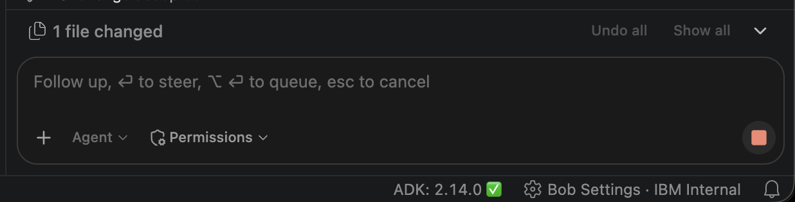
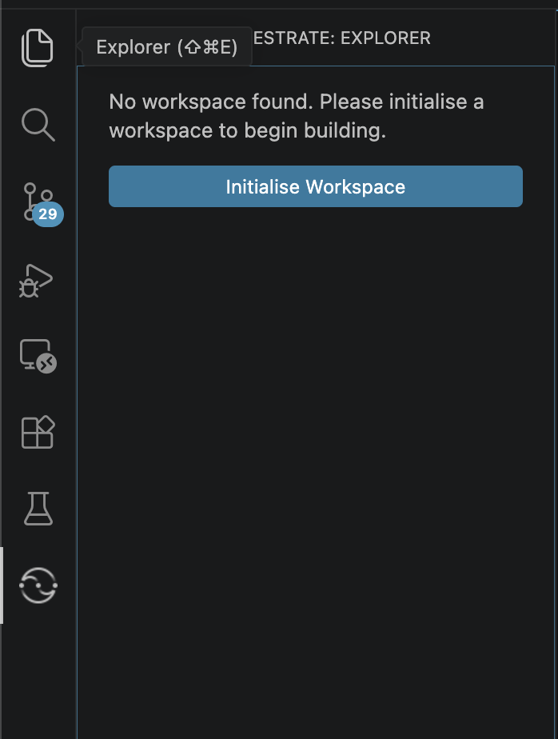
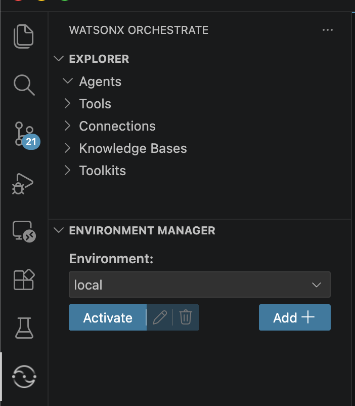
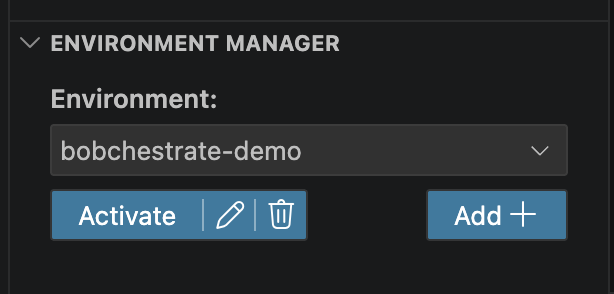
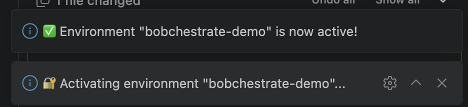

# Part 1: Setup & Environment

**Outcome:** A new `bobchestrate-ws` project connected to the workshop
watsonx Orchestrate environment.

## What we will implement

You will create the participant workspace, Python environment, ADK 2.14.0
installation, Bob workshop configuration, MCP connections, and active
watsonx Orchestrate environment used by the later parts.

!!! info "Everything runs inside Bob IDE"
    All terminal commands and Command Palette actions in this workshop are
    performed **inside IBM Bob IDE** — not in a separate system terminal.

    **How to open a terminal in Bob IDE** (same as VS Code):

    - Menu: **Terminal → New Terminal**
    - Keyboard: `` Ctrl+` `` (backtick) on Windows/Linux, `` Ctrl+` `` on macOS

    The terminal opens at the bottom of the editor, already pointed at your
    project folder.

    **How to open the Command Palette:**

    - **macOS:** `Cmd+Shift+P`
    - **Windows:** `Ctrl+Shift+P`

    The Command Palette is a quick-search bar at the top of Bob IDE where you
    type a command name and press Enter to run it — you will use it throughout
    this workshop.

!!! info "Two different sidebars — you will need both"
    Bob IDE has a narrow strip of icons down the far-left edge (the **Activity
    Bar**). Two of those icons matter here and they are easy to mix up:

    - The **Extensions** icon (four squares) opens the extension
      *marketplace* — you use it once, in Step 3, to install the ADK extension.
    - The **watsonx Orchestrate** icon opens the extension's own *panel*, which
      contains **Explorer**, **Initialise Workspace**, and **Environment
      Manager**. This is where Steps 6 and 8 happen.

    Clicking the extension's name under **Extensions → Installed** only opens
    its description page. It does **not** contain the buttons you need.

## 1. Create the participant project

Create a new empty folder called **`bobchestrate-ws`** anywhere on your machine.
Do not clone the workshop repository — start from an empty folder.

You can create the folder using any method you prefer:

- **Finder (macOS) / File Explorer (Windows):** right-click in the location you want and choose **New Folder**, then name it `bobchestrate-ws`.
- **Terminal / Command Prompt:**

    ```bash
    mkdir bobchestrate-ws
    ```

Once the folder exists, open IBM Bob IDE, sign in with your IBM ID, and select
**File → Open Folder → bobchestrate-ws**. Trust the workspace when prompted.

## 2. Verify prerequisites

Complete [Prerequisites](../part0-prerequisites/README.md), then open a terminal in Bob IDE:

=== "Windows PowerShell"

    ```powershell
    python --version
    uv --version
    ```

=== "macOS"

    ```bash
    python3 --version
    uv --version
    ```

Python must report `3.12.x`.

## 3. Install the ADK extension

1. Open the Extensions panel: `Cmd+Shift+X` on macOS or `Ctrl+Shift+X` on Windows.
2. Search for and install **IBM watsonx Orchestrate ADK**.

The extension must be installed before creating the virtual environment so
that Bob IDE can detect it during the next step.

## 4. Create the virtual environment

1. Open the Command Palette (`Cmd+Shift+P` / `Ctrl+Shift+P`).
2. Type **Python: Create Environment** and press Enter.
3. Choose **Venv**, then select the **Python 3.12** interpreter.
4. Open a new terminal in Bob IDE and confirm that `(.venv)` appears in its prompt.

### Terminal fallback

If **Python: Create Environment** is unavailable, open a terminal in
`bobchestrate-ws` and create the environment manually. Use the command for
your operating system:

=== "Windows PowerShell or Command Prompt"

    ```powershell
    python -m venv .venv
    ```

=== "macOS"

    ```bash
    python3 -m venv .venv
    ```

These commands use the Python 3.12 installation verified in Step 1. Then
activate `.venv` using the platform command below.

If automatic activation fails:

=== "Windows PowerShell"

    ```powershell
    Set-ExecutionPolicy -Scope Process -ExecutionPolicy Bypass
    .venv\Scripts\Activate.ps1
    ```

=== "Windows Command Prompt"

    ```cmd
    .venv\Scripts\activate.bat
    ```

=== "macOS"

    ```bash
    source .venv/bin/activate
    ```

The PowerShell change applies only to the current terminal session.

## 5. Install ADK 2.14.0 into the virtual environment

### Primary: Bob IDE extension

In the Bob IDE status bar — located in the **bottom-right corner**, next to the
Settings (gear) icon — the ADK extension shows a status indicator. It is **red**
until the ADK is installed. Click it and choose the option to install the ADK
into the `.venv` you created in Step 4.

When the install finishes, the indicator turns green and shows the installed
version:



Confirm the version in the terminal:

```bash
orchestrate --version
```

The first line must show `ADK Version: 2.14.0`.

### Backup: install via pip directly into `.venv`

If the extension button did not work, or the installed version is not 2.14.0,
run the following command from a terminal in `bobchestrate-ws`. It installs the
correct pinned version directly into `.venv`:

=== "Windows PowerShell or Command Prompt"

    ```powershell
    .\.venv\Scripts\python.exe -m pip install "ibm-watsonx-orchestrate[agentops]==2.14.0"
    ```

=== "macOS"

    ```bash
    ./.venv/bin/python -m pip install "ibm-watsonx-orchestrate[agentops]==2.14.0"
    ```

The command writes directly into `.venv`, so it works whether or not `.venv` is
active in your terminal.

### Add the evaluation dependencies

**Everyone runs this step**, including participants for whom the extension
button worked.

The optional Agent Evaluations & Red-Teaming module uses `orchestrate
evaluations`, which needs an extra package that the ADK install does **not**
include by default. If you used the pip backup above, this package is already
included — skip to the verification step below. If you used the extension
button, run the same pip command now to add it and pin the version:

=== "Windows PowerShell or Command Prompt"

    ```powershell
    .\.venv\Scripts\python.exe -m pip install "ibm-watsonx-orchestrate[agentops]==2.14.0"
    ```

=== "macOS"

    ```bash
    ./.venv/bin/python -m pip install "ibm-watsonx-orchestrate[agentops]==2.14.0"
    ```

Now activate `.venv` using the platform command in Step 4 and verify both results:

```bash
orchestrate --version
```

```bash
orchestrate evaluations red-teaming list
```

The first must report `ADK Version: 2.14.0`. The second must print a list of
attack plan names. If the second prints `No module named 'agentops'`, your
terminal is using a different Python than `.venv` — activate `.venv` and try
again.

!!! danger "Do not run the `--upgrade` command the ADK suggests"
    If you ever hit the `agentops` error, the ADK prints
    `pip install --upgrade "ibm-watsonx-orchestrate[agentops]"`. Running that
    moves you off 2.14.0 and breaks the workshop. Always install with the
    `==2.14.0` pin shown above.

## 6. Initialise the workspace and MCP servers

1. Click the **watsonx Orchestrate** icon in the Activity Bar (the strip of
   icons down the far-left edge). This opens the extension's own panel, titled
   **WATSONX ORCHESTRATE**. Do not use **Extensions → Installed** for this —
   that page has no buttons.
2. The panel shows *"No workspace found. Please initialise a workspace to begin
   building."* Click **Initialise Workspace**.

    

3. Open the Command Palette (`Cmd+Shift+P` on macOS / `Ctrl+Shift+P` on Windows), type **watsonx Orchestrate: Install WXO MCP Servers**, and press Enter.

Enter `2.14.0` when the MCP installer asks for a version.

Open **Bob Settings** (the ⚙️ gear in the **bottom-right** corner of the window,
next to the ADK indicator — not the VS Code settings gear) and select **MCP**.
Confirm that both `watsonx-orchestrate-adk` and `watsonx-orchestrate-adk-docs`
are **green** and show **Connected**. If either server is not green and
connected, stop and ask the instructor for help before continuing.

Open Bob chat and ask:

```text
What watsonx Orchestrate MCP servers are available?
```

Confirm that Bob reports both the ADK and ADK documentation servers. You can
also inspect them from the Command Palette (`Cmd+Shift+P` / `Ctrl+Shift+P`)
by typing **MCP Servers**.

## 7. Configure Bob for the workshop

The custom mode gives Bob a watsonx Orchestrate role and the tools it needs.
The workspace rule applies the workshop's ADK 2.14.0 conventions, safety
requirements, and known pitfalls in every Bob mode.

### Import the WXO Agent Architect mode

1. Click <a href="files/wxo-agent-architect-export.yaml" download="wxo-agent-architect-export.yaml">Download the WXO Agent Architect YAML file</a>.
   Your browser should save it automatically in your **Downloads** folder. If
   it opens the YAML instead, right-click the link and choose **Save Link As…**
   (or **Download Linked File** on macOS).
2. Open **Bob Settings** (gear icon ⚙️ in the bottom-right corner) and select **Modes**.
3. Click the **import icon** (↓ down arrow) and choose the YAML file from your **Downloads** folder.
4. After the import completes, open Bob chat and use the **mode selector** in
   the chat input box — the small dropdown on the bottom-left of the box that
   shows the current mode (for example **Agent ⌄**). Select
   **WXO Agent Architect** from the list.

### Install the workspace rule

<a href="files/wxo-dev-rule-enhanced.txt" download="wxo-dev-rule-enhanced.md">Download the workshop workspace rule</a>.

Now check what actually landed in your **Downloads** folder. A normal
left-click saves it as `wxo-dev-rule-enhanced.md`, but if you used
**Save Link As…** your browser may have kept the original `.txt` extension.

Move it from **Downloads** into `.bob/rules/`, using the terminal that is open
in your `bobchestrate-ws` project:

=== "Windows PowerShell"

    ```powershell
    New-Item -ItemType Directory -Force -Path .bob\rules
    Move-Item "$env:USERPROFILE\Downloads\wxo-dev-rule-enhanced.*" `
      .bob\rules\wxo-dev-rule-enhanced.md -Force
    ```

=== "macOS"

    ```bash
    mkdir -p .bob/rules
    mv ~/Downloads/wxo-dev-rule-enhanced.* .bob/rules/wxo-dev-rule-enhanced.md
    ```

Both commands accept either extension and always leave the file named
`wxo-dev-rule-enhanced.md`, which is the name Bob looks for. If the command
reports "No such file", the download did not reach your Downloads folder — check
your browser's download bar and repeat the download.

Start a new Bob task after installing the rule.

Checkpoint:

```text
Read the workspace rule in .bob/rules/. Summarize the ADK version, folder,
naming, model, documentation-lookup, tool-preference, and safety conventions you
will follow. Do not create or change files.
```

Bob should mention ADK 2.14.0, the workshop folders, `snake_case`,
`groq/openai/gpt-oss-120b`, the documentation MCP, credential safety, and that
it uses the `watsonx-orchestrate-adk` MCP server first and falls back to the
`orchestrate` CLI only when the MCP server cannot do the job.

## 8. Connect Orchestrate environment

You need the **Instance URL** and **API key** you saved in
[Prerequisites](../part0-prerequisites/README.md#collect-your-instance-url-and-api-key).
These are your own values from the environment you provisioned — nobody hands
them to you during the workshop. Treat the API key like a password: do not paste
it into Bob chat, save it in source files, or commit it.

1. Click the **watsonx Orchestrate** icon in the Activity Bar (the same icon you
   used in Step 6 — *not* Extensions → Installed).
2. Scroll to the **ENVIRONMENT MANAGER** section at the bottom of that panel and
   click **Add ＋**.

    

3. Bob prompts you for two values, one after the other, in an input box at the
   **top** of the window:

    | Prompt | What to enter |
    |---|---|
    | Environment name | A short name you invent, e.g. `bobchestrate-demo`. Write it down — later commands ask for it. |
    | Instance URL | The Instance URL you saved in Prerequisites, pasted whole. |

4. Your new environment now appears in the **Environment:** dropdown. Select it,
   then click **Activate**.

    

5. Bob prompts for the API key. Paste it into **this prompt only**. The
   characters appear masked.

6. A notification confirms the environment is active:

    

Verify the connection:

```bash
orchestrate agents list
```

An empty agent list is a successful result.

??? abstract "CLI fallback"

    ```bash
    orchestrate env add -n <environment-name> -u <instance-url>
    orchestrate env activate <environment-name> -a <api-key>
    orchestrate agents list
    ```

    If activation prints a warning, use `orchestrate agents list` to confirm
    authentication before proceeding.

!!! important
    Remote authentication expires periodically. If commands later return an
    authentication error, reactivate the environment from Environment Manager
    or run `orchestrate env activate <environment-name>` again.

## Setup checkpoint

Ask Bob to perform the non-secret checks:

```text
Inspect this workshop workspace and verify the setup without changing files.
Use the existing .venv. Check the Python and ADK versions, active Orchestrate
environment, expected workspace folders, and access to both Orchestrate MCP
servers. Run safe list or version commands where useful. Summarize anything I
must fix, but do not ask me to paste an API key into chat.
```

Your project should now contain a structure similar to:

```text
bobchestrate-ws/
├── .venv/
├── .bob/
│   ├── rules/
│   │   └── wxo-dev-rule-enhanced.md
│   ├── custom_modes.yaml
│   └── mcp.json
├── agents/
├── tools/
├── toolkits/
├── connections/
├── models/
├── knowledge-bases/
└── workspace_config.yaml
```

Empty folders are expected. If you take the optional Agent Evaluations &
Red-Teaming module you will add an `evaluation/` folder, and if you take the
optional MCP module you will add files under `toolkits/`. You do not need to
create them now.

!!! note "`knowledge-bases` uses a hyphen"
    The folder on disk is `knowledge-bases`, while the setting that points at it
    inside `workspace_config.yaml` is spelled `knowledge_bases`. That is normal —
    check your own `workspace_config.yaml` and use whichever folder name it
    lists.

Before continuing, confirm:

- `orchestrate --version` reports ADK 2.14.0
- `orchestrate evaluations red-teaming list` prints a list of attack names
- `orchestrate agents list` succeeds
- WXO Agent Architect mode is selected
- `.bob/rules/wxo-dev-rule-enhanced.md` exists
- Bob can access the two Orchestrate MCP servers

!!! tip "Stuck?"
    Copy the tested configuration files for this part from the
    [reference solution](../solution/README.md#part-1-setup), then continue.

## Troubleshooting

??? question "`orchestrate: command not found`"

    Activate `.venv` using the platform command in Step 4. If the ADK is still
    absent, reinstall it from the extension's status indicator.

    This is the most common error in every later part too. Each **new** terminal
    must have `.venv` active — look for `(.venv)` at the start of the prompt
    before running any `orchestrate` command.

??? question "`No module named 'agentops'`"

    The evaluation dependencies are missing. Install them with the pinned
    command in [Step 5](#add-the-evaluation-dependencies). Do **not** use the
    `--upgrade` form the error message suggests — it moves you off ADK 2.14.0.

??? question "Authentication failed"

    ```bash
    orchestrate env list
    orchestrate env activate <environment-name>
    orchestrate agents list
    ```

??? question "Bob cannot access the MCP servers"

    Open **Settings → MCP** and confirm that both
    `watsonx-orchestrate-adk` and `watsonx-orchestrate-adk-docs` are green and
    connected. Restart any stopped server. If either server remains unhealthy,
    ask the instructor for help instead of continuing.

??? question "Windows MCP documentation server fails to start"

    Use this Windows-only fallback only if the regular MCP setup does not work.
    Download the
    <a href="../solution/bob-config/mcp-windows-fallback.json" download="mcp.json">Windows fallback mcp.json</a>
    and replace `.bob/mcp.json`. Do not use this fallback on macOS.

    **You must edit the file before reloading Bob.** It ships with a
    placeholder:

    ```json
    "WXO_MCP_WORKING_DIRECTORY": "<ABSOLUTE_PATH_TO_YOUR_WORKSPACE>"
    ```

    Replace the placeholder — quotes included — with the full path to your
    `bobchestrate-ws` folder, for example
    `C:\\Users\\yourname\\bobchestrate-ws`. In Bob IDE you can copy that path by
    right-clicking the project folder in the file Explorer and choosing **Copy
    Path**. Leaving the placeholder in place stops the ADK MCP server from
    starting. Reload Bob after saving.

    A common Windows cause is an incompatible `mcp` SDK selected by
    `mcp-proxy`. Because its dependency range has no upper bound, the resolver
    can select an SDK that causes `ImportError: cannot import name
    'request_ctx'`. Reconfigure the documentation server with the compatible
    SDK pin and system certificate support. In PowerShell, use:

    ```powershell
    uvx --system-certs `
      --with mcp==1.28.0 `
      mcp-proxy `
      --transport streamablehttp `
      https://developer.watson-orchestrate.ibm.com/mcp
    ```

    If the error is certificate-related, prefer the organization's CA bundle:

    ```text
    --verify-ssl C:\path\to\company-ca-bundle.pem
    ```

    Use `--verify-ssl false` only as a temporary diagnostic workaround, not as
    the permanent configuration. The Watsonx endpoint may still be healthy;
    this workaround only diagnoses local certificate trust. After updating the
    server, return to **Settings → MCP** and confirm that both servers are green
    and connected.

[Continue to Part 2: Building Your First Agent →](../part2-first-agent/README.md)
