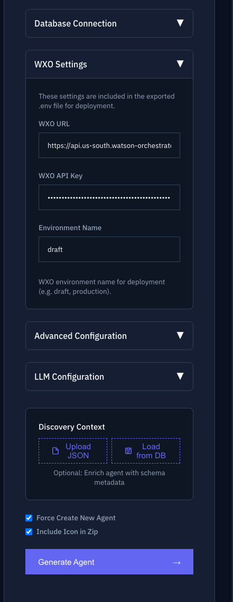
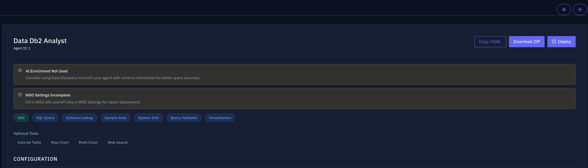
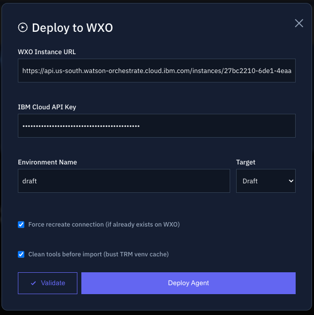

# Part 10: NL2SQL Agent with the IBM CE Accelerator

**Duration:** 30 min  
**Level:** Intermediate  
**Objective:** Use the IBM Client Engineering NL2SQL accelerator to generate a working Natural Language to SQL agent directly in watsonx Orchestrate — no coding required. Then pick up where the accelerator leaves off and continue developing the agent with Bob.

---

## What You'll Build

A fully functional **NL2SQL agent** that lets users query a database in plain English. The agent is generated automatically by the accelerator and deployed straight into watsonx Orchestrate.

---

## How It Works

```
Database  →  Data Discovery  →  NL2SQL Asset  →  watsonx Orchestrate Agent
                                                          ↓
                                              Continue development with Bob
```

The accelerator handles everything up to agent generation. Once the agent is live in Orchestrate, you can extend and customise it using Bob.

!!! note "No Bob in this part"
    This part uses the IBM NL2SQL accelerator only — IBM Bob is not involved until the very end. You don't need the ADK or Python environment.

---

## Demo 1 — Query Your Data in Plain English

Before building the agent, here is what it can do once deployed: ask a business question in natural language (for example, checking which stores are open for an event) and get the answer directly from the database — without writing a single line of SQL. The agent translates the question into a SQL query, runs it, and returns a readable result.

<video controls width="100%" style="border-radius:6px; margin: 1rem 0;">
  <source src="videos/1-demo-open-stores.mp4" type="video/mp4">
  Your browser does not support the video tag.
</video>

---

## Demo 2 — Results with Charts

The agent is not limited to text answers — it can also generate visual charts from query results, making data easier to analyse and share with business users.

<video controls width="100%" style="border-radius:6px; margin: 1rem 0;">
  <source src="videos/2-demo-graph.mp4" type="video/mp4">
  Your browser does not support the video tag.
</video>

---

## The NL2SQL Accelerator

The agent builder used in this part is the **IBM CE NL2SQL Accelerator** — an IBM Client Engineering tool that automates the full pipeline from database connection to deployed watsonx Orchestrate agent.

👉 **[Open the NL2SQL Accelerator](https://github.ibm.com/tech-garage-spgi/ce-israel-txt2data-template)**

---

## Step 1 — Connect the wxo API Key & Create the Agent

Once data discovery is complete, connect your watsonx Orchestrate API key to the accelerator. This allows the accelerator to deploy the agent directly onto the platform. Then launch the NL2SQL agent creation from the accelerator — it uses the discovery results to configure the agent automatically.

### 1a — Configure WXO Settings

Scroll down the accelerator configuration page. Under **Database Connection**, leave the pre-filled values as they are — they point to the shared workshop database.

Under **WXO Settings**, fill in your own values:

- **WXO URL** — your watsonx Orchestrate instance URL (e.g. `https://api.us-south.watson-orchestrate.cloud.ibm.com/instances/<your-id>`)
- **WXO API Key** — your IBM Cloud API key
- **Environment Name** — leave as `draft`

Once the settings are filled in, click **Generate Agent**.



### 1b — Review the Generated Agent

The accelerator generates the agent and displays a summary page with the agent name, its tools, and any configuration warnings.

!!! tip
    Ignore the "WXO Settings Incomplete" warning if it appears — it is shown because the form values were entered after the page loaded. Your credentials were saved correctly.



### 1c — Deploy and Validate

Click **Deploy** in the top-right corner. A **Deploy to WXO** dialog appears with your WXO Instance URL and IBM Cloud API Key pre-filled from the settings you entered.

Click **Validate** first to confirm the connection is working, then click **Deploy Agent**.



<video controls width="100%" style="border-radius:6px; margin: 1rem 0;">
  <source src="videos/4-connect-wxo-create-agent.mp4" type="video/mp4">
  Your browser does not support the video tag.
</video>

---

## Step 2 — Connect the Database & Run Data Discovery

The first step is connecting your source database to the accelerator. This connection triggers the **data discovery** phase: the accelerator scans the database schema (tables, columns, relationships) to understand the data structure. This understanding is what enables the agent to generate accurate SQL queries.

<video controls width="100%" style="border-radius:6px; margin: 1rem 0;">
  <source src="videos/3-connect-db-discovery.mp4" type="video/mp4">
  Your browser does not support the video tag.
</video>

!!! tip
    Review and correct table and column descriptions after discovery — the better the metadata, the more accurate the generated SQL.

---

## Step 3 — The Agent is Ready on watsonx Orchestrate

The agent is now deployed and available on the watsonx Orchestrate platform. Users can start asking questions in natural language straight away — the agent queries the connected database and returns the answer, exactly as shown in Demos 1 and 2.

<video controls width="100%" style="border-radius:6px; margin: 1rem 0;">
  <source src="videos/5-agent-ready.mp4" type="video/mp4">
  Your browser does not support the video tag.
</video>

---

## Summary

| # | Step | Content |
|---|---|---|
| 1 | Demo: business question in natural language | Demo 1 — Open stores |
| 2 | Demo: results with charts | Demo 2 — Graph |
| 3 | Connect the wxo API key + create the agent | Step 1 |
| 4 | Connect the database + data discovery | Step 2 |
| 5 | Agent live on watsonx Orchestrate | Step 3 |

---

## Test the Agent — Sample Questions

Once your NL2SQL agent is live, use the following questions to verify it is working correctly. Each question covers a different query type — aggregation, grouping, ranking, and filtering.

| # | Question |
|---|----------|
| 1 | What were the total units sold and net revenue on January 1 2024? |
| 2 | What was the average basket value for each store type (Express, Supermarket, Hypermarket)? |
| 3 | Which month in 2024 had the highest net revenue for the whole chain? |
| 4 | Which product category generated the most net revenue in 2024? |
| 5 | How many products are kosher? |
| 6 | How many active stores are open on Shabbat? |

---

## What's Next — Continue with Bob

You now have a working NL2SQL agent in watsonx Orchestrate. The accelerator got you there fast — but Bob can take it further.

Here are things you can do next with Bob:

- **Add custom tools** — enrich the agent with tools that combine SQL results with business logic
- **Add guidelines** — control which types of queries the agent accepts or rejects
- **Add guardrails** — prevent SQL injection or sensitive data exposure
- **Add collaborators** — connect the NL2SQL agent to other specialist agents
- **Add a knowledge base** — let the agent explain query results using business documentation

## Key Takeaways

✅ The NL2SQL accelerator creates a production-ready agent without writing any code  
✅ Data discovery gives the LLM the context it needs to generate accurate SQL  
✅ The agent is fully editable in watsonx Orchestrate once generated  
✅ Bob picks up exactly where the accelerator leaves off
